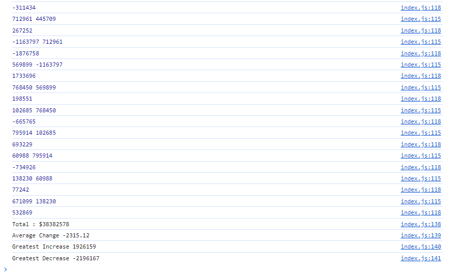

# Links of Live URL and Github
https://rashid-subhani.github.io/capital-sync-financial/
https://github.com/rashid-subhani/capital-sync-financial

# capital-sync-financial
This is a cutting-edge financial company committed to revolutionizing the way businesses manage the finances.

# Initialization variables:

Intialized variables to store important information, like the total number of months, total profits, average change, and the details of the greatest increase and decrease in profits.

# Loop through the Data:

I went through each entry in the financial data (each month) using a loop.
For each month, calculate the total profits by adding up the profit or loss for that month to the overall total. Also calculate the average change in profits from one month to the next, excluding the first month.

# Greatest Increase and Decrease:

While going through each month, check if the profit for that month is greater or less than the current greatest increase or decrease. If so, update the details of the greatest increase or decrease.

# Calculate Average Change:

After looping through all the months, divide the total change in profits by the number of months minus one to get the average change.

# Display Results:

Finally the results, including the total number of months, net total profits, average change in profits, and details of the greatest increase and decrease.

screenshot link:

